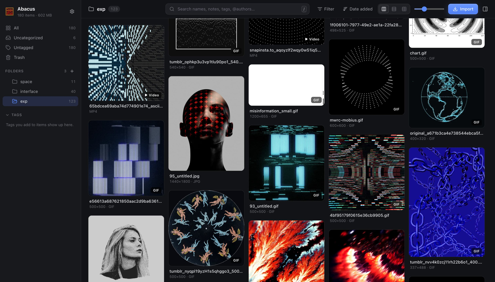

# 🧮 Abacus

Abacus is a self-hosted digital asset management (DAM) system for images, GIFs, videos, and saved posts.
It runs as a web app with a Node.js backend and a SQLite database, and ships as a single Docker image.



## Features

- Grid view with three layouts: waterfall, justified rows, and square grid.
- Nested folders with colors. An item can belong to more than one folder.
- Tags, notes, and 0–5 star ratings.
- Search across names, notes, tags, post text, authors, and URLs.
- Filters by type, source, rating, and dominant color.
- Import from X (Twitter) post links, image and video URLs, web pages, Are.na channel exports, and local
  files.
- A bookmarklet that saves the current page from any browser.
- A full-screen viewer with zoom and keyboard navigation.

## Requirements

- Docker with Docker Compose, or
- Node.js 22.13 or later to run without Docker.

## Run with Docker

1. Clone the repository:

   ```bash
   git clone https://github.com/ferraridavide/abacus.git
   cd abacus
   ```

1. Build and start the container:

   ```bash
   docker compose up -d --build
   ```

1. Open <http://localhost:8080>.

The database, original files, and thumbnails are stored in the `abacus-data` Docker volume.

## Run locally

1. Install dependencies:

   ```bash
   npm run install:all
   ```

1. Start the API server and the web client:

   ```bash
   npm run dev
   ```

   The API server listens on port 8080 and stores data in `./data`. The web client listens on port 5173
   and proxies API requests to the server.

To run a production build without Docker:

```bash
npm run build
npm start
```

## Configuration

Set these environment variables in `docker-compose.yml` or in your shell.

| Variable             | Default  | Description                                              |
| -------------------- | -------- | -------------------------------------------------------- |
| `PORT`               | `8080`   | HTTP port.                                               |
| `DATA_DIR`           | `./data` | Directory for the database, files, and thumbnails.       |
| `AUTH_PASSWORD`      | None     | If set, the server requires HTTP basic authentication.   |
| `AUTH_USER`          | `abacus` | User name for basic authentication.                      |
| `IMPORT_CONCURRENCY` | `3`      | Number of links fetched in parallel during an import.    |
| `MAX_DOWNLOAD_MB`    | `1024`   | Maximum size of a single downloaded or uploaded file.    |

Per-browser preferences, such as layout, thumbnail size, and video autoplay, are set in **Settings**.

## Import content

To open the import dialog, click **Import**. You can also drop files or paste links anywhere in the window.

### X posts

Paste one or more post URLs. Abacus detects every post link in the pasted text. Photos are saved at
original resolution, and videos and GIFs are saved as MP4. Posts without media are saved as text cards.
The author, post text, and post date are stored with each item.

Abacus reads posts through X's public embed endpoint and falls back to the public fxtwitter API. Neither
requires an API key. Protected and deleted posts can't be imported.

### Are.na

1. In Are.na, open a channel and export it as a .zip file.
1. Drop the .zip file into Abacus, or select it on the **Are.na** tab of the import dialog.

Each channel becomes a folder. Block titles, descriptions, source URLs, and dates are kept.

### Bookmarklet

On the **Bookmarklet** tab of the import dialog, drag the **Save to Abacus** button to your bookmarks bar.
Click the bookmark on any page to save that page or post to your library.

Importing the same item twice doesn't create a duplicate.

## Data storage

| Path                     | Contents                       |
| ------------------------ | ------------------------------ |
| `DATA_DIR/library.db`    | SQLite database (WAL mode).    |
| `DATA_DIR/files/<id>/`   | Original files.                |
| `DATA_DIR/thumbs/`       | WebP thumbnails.               |

To back up a library, copy `DATA_DIR` while the server is stopped.
